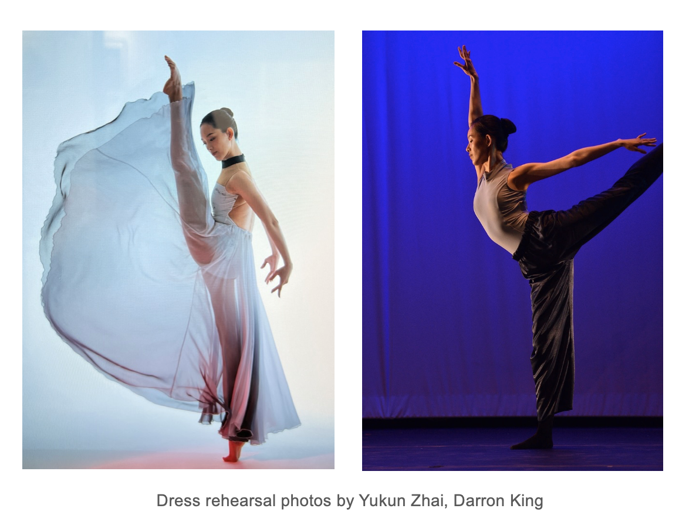

I am a final-year Ph.D. student in the ECE department at University of Illinois, Urbana-Champaign. I am fortunate to be advised by Prof. [Subhonmesh Bose](http://boses.ece.illinois.edu/). Prior to this, I received M.Eng. from UIUC and B.S. from Zhejiang University in 2019. 

# News:
April 2024: Invited presentation at [Machine Learning and Dynamical Systems Seminar](https://www.turing.ac.uk/research/interest-groups/machine-learning-and-dynamical-systems) at the Alan Turing Institute and [the 4th Symposium on Machine Learning and Dynamical Systems](https://sites.google.com/site/boumedienehamzi/home/fourth-symposium-on-machine-learning-and-dynamical-systems) at the Fields Institute.

April 2024: I'll present at [the 10th Midwest Workshop on Control and Game Theory](https://mwcgt2024.northwestern.edu/) at Northwestern. 

# Research

- ## Nonparametric Compressed Learning of Dynamical Systems:
 
  - **B. Hou**, S. Sanjari, N. Dahlin, S. Bose, U. Vaidya, “Sparse Learning of Dynamical Systems in Reproducing Kernel Hilbert Space: An Operator-Theoretic Approach”, in Proceedings of the Fortieth International Conference on Machine Learning (ICML), 2023. [download](https://proceedings.mlr.press/v202/hou23c.html)

  - **B. Hou**, S. Sanjari, N. Dahlin, S. Bose, “Compressed Decentralized Learning of Conditional Mean Embedding Operators in Reproducing Kernel Hilbert Space”, in Proceedings of the 37th Association for the Advancement of Artificial Intelligence (AAAI) Conference on Artificial Intelligence, 2023. [download](https://ojs.aaai.org/index.php/AAAI/article/view/25956)

  - **B. Hou**, A.Reddy Ramapuram Matavalam, S.Bose, U.Vaidya, "Propagating Uncertainty Through System Dynamics in Reproducing Kernel Hilbert Space ", Physica D: Nonlinear Phenomena. Special issue: Topics at the Interface of Machine Learning and Dynamical Systems, 2024. [download](https://doi.org/10.1016/j.physd.2024.134168)
    
    Also presented as a poster paper at the American Control Conference (ACC) 2023.
    
  - **B. Hou**, S. Bose and U. Vaidya, “Sparse Learning of Kernel Transfer Operators”, in Proceedings of the Asilomar Conference on Signals, Systems, and Computers, 2021. [download](https://ieeexplore.ieee.org/abstract/document/9723412)

  - (Preprint) A.Reddy Ramapuram Matavalam, **B. Hou**, H.Choi, S.Bose, U.Vaidya, “Data-Driven Transient Stability Analysis Using the Koopman Operator”, under submission at the International Journal of Electrical Power and Energy Systems, 2024. [download](https://papers.ssrn.com/sol3/papers.cfm?abstract_id=4805006)
 
  - (Preprint) **B. Hou**, S. Sanjari, A. Koppel, S. Bose, "Compressed Online Learning of Conditional Distribution with Kernels". [download](https://arxiv.org/abs/2405.07432)

- ## Preparing Electrified Transportation:
   Electrification can help to reduce the carbon footprint of aviation. The transition away from the jet fuel-powered airplane towards battery-powered electrified aircraft will impose extra charging requirements on airports. In order to handle the impending electrification of commercial aviation, I study the interdependency of transportation (airlines) and the energy infrastructure at airports.

  -  **B. Hou**, S. Bose, L. Marla and K. Haran, “Impact of Aviation Electrification on Airports: Flight Scheduling and Charging”, IEEE Transactions on Intelligent Transportation Systems, 2023. [download](https://ieeexplore.ieee.org/stamp/stamp.jsp?arnumber=10296862)

  -  **B. Hou**, S. Bose, and K. Haran, “Powering Electric Aircraft at O'Hare Airport: A Case Study”, presented at the IEEE Power and Energy Society General Meeting, 2020. [download](https://ieeexplore.ieee.org/abstract/document/9281871)

# Awards
- Rising Stars in EECS, 2023
- M.A.Pai Scholarship, 2023
-	Mavis Future Faculty Fellows (MF3), 2023-2024
- AAAI Student Scholarship, 2023
- The second-place winner in the United States Association for Energy Economics (USAEE) Case Competition, 2019.
- UCLA Cross-disciplinary Scholars in Science and Technology (CSST) Scholarship, 2017

# Teaching
Fall 2021, Teaching Assistant, ECE 365 Data Science and Engineering, UIUC.

# Fun
Outside of mathematics and engineering, I pursue my passion for dancing. I performed contemporary ballet and dance of the Han-Tang dynasties (a subcategory of Classical Chinese Dance) with Champaign Park District and Zhejiang Wenqin Art Troupe. 

