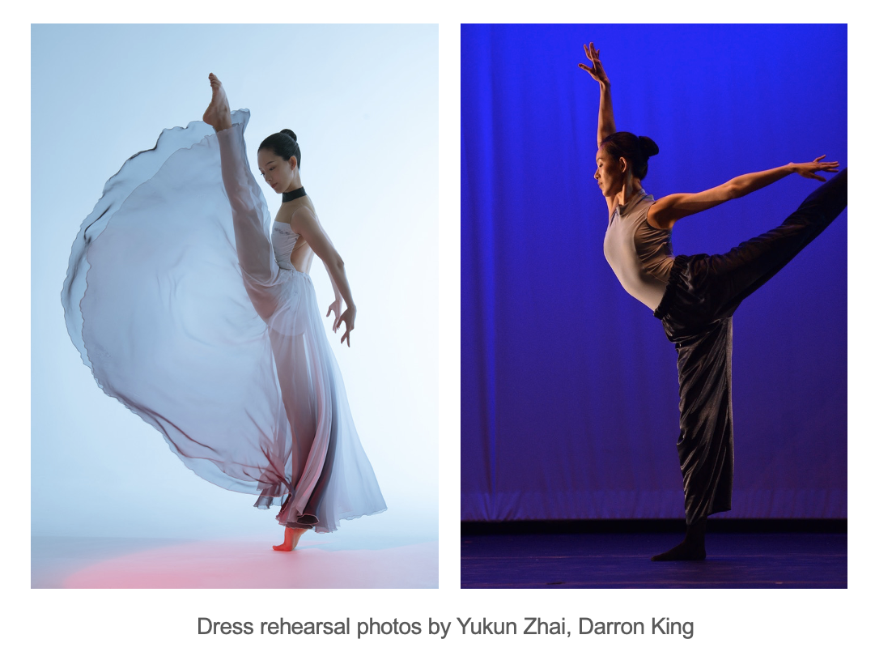

I am a 4th year PhD student in ECE department at the University of Illinois, Urbana-Champaign. I am fortunate to be advised by Prof. [Subhonmesh Bose](http://boses.ece.illinois.edu/). Prior to this, I received Master of Engineering in Electrical and Computer Engineering from University of Illinois, Urbana-Champaign in December 2019 and BS in Electrical and Computer Engineering from Zhejiang University in March 2019. 
My research centers around \textbf{efficient data-driven learning for effective control in uncertain environments}: I draw on tools from applied mathematics, machine learning, and control theory to develop data-efficient decision-making algorithms with theoretical guarantees. 

Please find my CV here: [CV](../assets/BoyaCV.pdf)

# Research:

- ## Parsimonious Non-parametric Learning of Dynamical Systems:
    I am interested in learning \emph{parsimonious} representations of dynamical systems from data in both single-agent and multi-agent contexts. My research focuses on an operator-theoretic approach to capture the action of the system dynamics on suitable spaces of functions--[Reproducing Kernel Hilbert Space (RKHS)](https://en.wikipedia.org/wiki/Reproducing_kernel_Hilbert_space)--that does not require parametric representations, and thus, makes it appealing from a data-oriented standpoint. I integrated this approach into reinforcement learning, characterization of regions of attraction, uncertainty propagation, and transient stability analysis of power systems. 

  - **B. Hou**, S. Sanjari, N. Dahlin, S. Bose, U. Vaidya, “Sparse Learning of Dynamical System in Reproducing Kernel Hilbert Space: An Operator-Theoretic Approach”, accepted at ICML 2023. [paper](../assets/ICML_2023.pdf)

  - **B. Hou**, A.Reddy Ramapuram Matavalam, S.Bose, U.Vaidya, "Propagation of Uncertainty Through System Dynamics in Reproducing Kernel Hilbert Spaces with Data", presented as poster paper at ACC 2023.

  - **B. Hou**, S. Sanjari, N. Dahlin, S. Bose, “Compressed Decentralized Learning of Conditional Mean Embedding Operators in Reproducing Kernel Hilbert Space”, presented at AAAI, 2023. [paper](../assets/AAAI_2023.pdf)

  - **B. Hou**, S. Bose and U. Vaidya, “Sparse Learning of Kernel Transfer Operators”, presented at the Asilomar Conference on Signals, Systems, and Computers, 2021. [paper](../assets/Asilomar2021.pdf)

- ## Preparing electrified transportation:
   Electrification can help to reduce the carbon footprint of aviation. The transition away from the jet fuel-powered airplane towards battery-powered electrified aircraft will impose extra charging requirements on airports. In order to handle the impending electrification of commercial aviation, we study the interdependency of transportation (airlines) and the energy infrastructure at airports.

  - **B. Hou**, S. Bose, L. Marla and K. Haran, “Impact of Aviation Electrification on Airports: Flight Scheduling and Charging”, under submission at IEEE Transactions on Intelligent Transportation Systems. [paper](../assets/HEA_ITS.pdf)

  - **B. Hou**, S. Bose, and K. Haran, “Powering Electric Aircraft at O'Hare Airport: A Case Study”, presented at the IEEE Power and Energy Society General Meeting, 2020.

# Teaching
Fall 2021, Teaching Assistant, ECE 365 Data Science and Engineering, UIUC.

# Fun
Outside of mathmatics and engineering, I pursue my passion for dancing. I performed contemporary ballet and dance of the Han-Tang dynasties (a subcategory of Classical Chinese Dance) with Champaign Park District and Zhejiang Wenqin Art Troupe. 

Photo by Darren King during dress rehearsal, May 2023.

